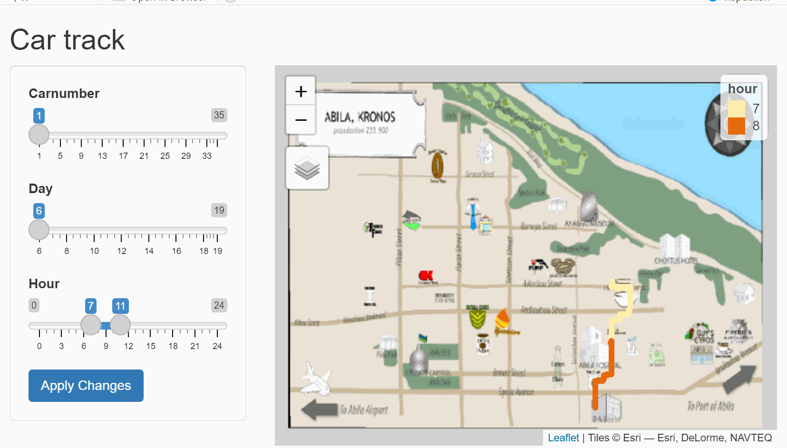

```{r setup,include=FALSE}
options(htmltoools.dir.version=FALSE)
knitr::opts_chunk$set(
	eval = TRUE,
	echo = TRUE,
	fig.retina = 3,
	message = FALSE,
	warning = FALSE
)
```

# Introduction
In the roughly twenty years that Tethys-based GAStech has been operating a natural gas production site in the island country of Kronos, it has produced remarkable profits and developed strong relationships with the government of Kronos. However, GAStech has not been as successful in demonstrating environmental stewardship. 

In January, 2014, the leaders of GAStech are celebrating their new-found fortune as a result of the initial public offering of their very successful company. In the midst of this celebration, several employees of GAStech go missing. An organization known as the Protectors of Kronos (POK) is suspected in the disappearance, but things may not be what they seem. 

And we will going to identify anomalies and suspicious behaviors, and identify which people use which credit and loyalty cards. 

# Literature review

After reading some seniors articles, I leaner from YiFei that it is useful to use a map track grouped by different department of employees. 
Besides, Han Ying's assignments used a network to show the informal relationships, which helped to understand the linking bettwen employees.


# Data preperation 

## Installing and lauching R packages

First, we install and library all packages we might use. 
Here we need 3 parts of packages: data preparation, graph builder, and Rshiny. 

```{r}
packages = c('ggiraph','tidyverse','plotly','lubridate','stringi','scales','hms','ggplot2','ggpubr','raster','tmap','sf','clock','gifski','mapview','ggthemes','bipartite','GGally','devtools','widgetframe','igraph','visNetwork','tidygraph','ggraph')
for(p in packages){
  if(!require(p,character.only=T)){
    install.packages(p)
  }
  library(p,character.only=T)
}

if(!require(ggbipart)){
    devtools::install_github("pedroj/bipartite_plots")
  }
  library(ggbipart)
if(!require(ggnet)){
    devtools::install_github("briatte/ggnet")
  }
  library(ggnet)

```

## Importing Data

We have 14-days history transaction of credit card history and loyalty card (GAStech gave employees for credits), include the store name, price, datetime and card numder. 

Besides, we also have 14-days gps history of company's car, which includes the name, gps, time. Also, we have list of employees' name, department, job title and their assigned car ID. 

```{r}
carassignments <- read_csv("data/car-assignments.csv")
ccdata <- read_csv("data/cc_data.csv")
gps <- read_csv("data/gps.csv")
loyaltydata <- read_csv("data/loyalty_data.csv")
```

```{r}
loyaltydata$timestamp = mdy(loyaltydata$timestamp)
loyaltydata$location=parse_character(loyaltydata$location, locale = locale(encoding = "windows-1250"))
ccdata$timestamp = mdy_hm(ccdata$timestamp)
ccdata$last4ccnum=as.character(ccdata$last4ccnum)
ccdata$location=parse_character(ccdata$location, locale = locale(encoding = "windows-1250"))
gps$Timestamp<-mdy_hms(gps$Timestamp)
gps$date<-date(gps$Timestamp)
```

GAStech has 44 employees, 35 of them (expect drivers) has assigned car.

```{r}
knitr::kable(head(carassignments[,1:5]), "simple")
```

There is 54 loyalty card record and 55 credit card record.

```{r}
knitr::kable(head(loyaltydata[,1:4]), "simple")
```

```{r}
knitr::kable(head(ccdata[,1:4]), "simple")
```

And there is 35 cars GPS card and map.


# Analysis and answers 

## Most popular place

There is in total 34 shops employees have been visited. We notice that Katerina’s Café; Hippokampos; Guy's Gyros; Brew've Been Served; Hallowed Grounds are most poplar places employees like. Unsurprisely, all of them provide food and beverage. 

```{r}
ccdata_popular<-ccdata %>%
 group_by(location) %>%
  summarise(times=n()) %>%
  arrange(desc(times))%>%
  head(5)

ggplot(ccdata_popular,aes(x = reorder(location,-times),y=times))+
  labs(y="Visit times")+
  labs(x="Locations")+
  geom_bar(fill = "#669933",stat = "identity", width = 0.5)+
  theme(axis.text.x = element_text(face="bold", size=7))+
  ggtitle("Most Popular Locations")
```


## Least popular place

And we also notice Daily Dealz, Frank's Fuel, U-Pump, Abila Scrapyard, Octavio's Office Supplies are the least shops. We notice only one employee (we only know his credit number) visited Daily Dealz. 
We might want to use these data cause it is earlier to find who visit those shops by gps data. So we can find out who owns this credit card. 

```{r}
ccdata_leastpopular<-ccdata %>%
 group_by(location) %>%
  summarise(times=n()) %>%
  arrange(desc(-times))%>%
  head(5)
ccdata_leastpopular$location<-as.factor(ccdata_leastpopular$location)

ggplot(ccdata_leastpopular,aes(x = reorder(location,-times),y=times))+
  labs(y="how many times customers visit")+
  labs(x="locations")+
  ggtitle("least popular locations")+
  geom_bar(fill = "#669933",stat = "identity", width = 0.5)+
  theme(axis.text.x = element_text(face="bold", size=7))
```

## Which day the most popular shops have most employees visiting?

We notice that during weekend, few employees visit Guy's Gyros. 

```{r}
ccdata_populartime<-ccdata %>%
  filter(location %in% ccdata_popular$location) 
   ccdata_populartime$date=date(ccdata_populartime$timestamp)
   
ccdata_populartime<-ccdata_populartime  %>%
   group_by(date,location)%>%
   summarise(customers=n())%>%
   ungroup()
p1<-ggplot(ccdata_populartime, 
           aes(x=date, 
               y = customers
               ,color=location
               )) +
  scale_x_date(date_breaks = "1 days",
               labels = scales::label_date_short()
               ) +
   geom_line() +
  ggtitle("Most popular shops by credit card")
p1
```

## When the most popular shops have most employees visiting?

We can see from this graph, employees often visit Brew've Been Served & Hallowed Grounds in the morning (7am to 8am), and visit Katerina’s Café & Hippokampos & Guy's Gyros at lunch time (12pm to 14pm) and after work (18pm to 22pm).
From map, we can see except Hallowed Grounds, the rest four are all vary close GAStech, no wonder employees like eating lunch or relax there.

```{r}
ccdata_populartime<-ccdata %>%
  filter(location %in% ccdata_popular$location) 
   ccdata_populartime$hm=as_hms(ccdata_populartime$timestamp)
   ccdata_populartime$hour=hour(ccdata_populartime$timestamp)
ccdata_populartime<-ccdata_populartime  %>%
   group_by(hour,location)%>%
   summarise(customers=n())%>%
   ungroup()
ggplot(ccdata_populartime, 
           aes(x=hour, y = customers,color=location)) +
  xlim(0,23)+
   ggtitle("what time are shops most popular?")+
   geom_line() 

```


## Employees who hang out together

We also can find some interesting informal relationship between employees. For instance, we know golf is a good network sports and some of our employees do enjoy golf. Lets find out in our employees, who went Desafio Golf Course? When do they go?

In this graph, we notice that indeed three employees went golf on every Sunday. And two more employees joins on the second Sunday.

```{r}
ccdata_popcus<-ccdata %>%
  filter(location=="Desafio Golf Course")%>%
  group_by(last4ccnum)%>%
   summarise(times=n()) %>%
  arrange(desc(times))%>%
  head(10)%>%
  ungroup()

ccdata_popcustime<-ccdata %>%
   filter(location=="Desafio Golf Course" ) 
ccdata_popcustime$date=date(ccdata_popcustime$timestamp)

ggplot(ccdata_popcustime,aes(x=date,y=last4ccnum,color=last4ccnum))+
  scale_x_date(date_breaks = "1 days")+
  theme(axis.text.x = element_text(angle = 90))+
  ggtitle("Who and when visit Desafio Golf Course")+
   geom_point()
```

## The ccnumber and loyalty number have alot in common

The loyalty card is given by GAStech to reward the customer for buying goods or services. So employees may use it while shopping and may not. If employees use it while shopping,it would has a same record in loyalty data as it in ccdata. 
This graph below shows the most popular shops by two dataset. The similarity of these two graphs shows a example that two data set have a lot in common, especially lines for Brew've Been Sreved, Guy's Gyros and Hallowed Grounds. 

```{r}
loyaltydata_popular<-loyaltydata %>%
 group_by(location) %>%
  summarise(times=n()) %>%
  arrange(desc(times))%>%
  head(5)

loyaltydata_populartime<-loyaltydata  
   loyaltydata_populartime$date=date(loyaltydata_populartime$timestamp)
  loyaltydata_populartime<-loyaltydata_populartime%>%
  filter(location %in% loyaltydata_popular$location)%>%
   group_by(date,location)%>%
   summarise(customers=n())%>%
   ungroup()
  
  p2<- ggplot(loyaltydata_populartime, 
           aes(x=date, y = customers,color=location)) +
   scale_x_date(date_breaks = "1 days",
               labels = scales::label_date_short()
               ) +
   geom_line() +
   ggtitle("Most popular shops by loyalty card")
  
   ggarrange(p1, p2,nrow = 2)
```


## GPS graph

Now we will add gps data into our analysis.
From this map we can identify some familiar shops we have in our ccdata and loyaltydata, such as: Bean There Done That, Brew've Been Served... 
There are also some shops not shown in this map, such as: Abila Zacharo, Hippokampos... 
This gives some challenges for us. 

```{r}
bgmap <-raster("data/MC2-tourist.tif")
tm_shape(bgmap)+
  tm_rgb(bgmap,r=1,g=2,b=3,
   alpha=NA,
   saturation=1,
   interpolate=TRUE,
   max.value=255)

Abila_st <- st_read(dsn = "data/Geospatial",
                    layer = "Abila")

gps_sf <- st_as_sf(gps, 
                   coords = c("long", "lat"),
                       crs= 4326)

gps_path <- gps_sf %>%
  group_by(id, date) %>%
  summarize(m = mean(Timestamp), 
            do_union=FALSE) %>%
st_cast("LINESTRING")
```

This graph shows the path of car2 and car3 have visited during 14 days. 

Their path includes: home, GAStech (company), and food and beverage shops they visit. 

Besides, we notice car 3 went Frank's Fuel once, which is one of the least popular shops. 

Whats more, we can see it clearly, the travel paths of driver2 (left) and driver3 (right) are almost the same. It might because they are both Engineer so they are together often. 

```{r}
gps_path_selected <- gps_path %>%
  filter(id==2) 

tmap2<-tm_shape(bgmap) +
  tm_rgb(bgmap, r = 1,g = 2,b = 3,
       alpha = NA,
       saturation = 1,
       interpolate = TRUE,
       max.value = 255) +
  tm_shape(gps_path_selected) +
  tm_lines()+
  tm_layout(title = "Car2")

gps_path_selected <- gps_path %>%
  filter(id==3)
tmap3<-tm_shape(bgmap) +
  tm_rgb(bgmap, r = 1,g = 2,b = 3,
       alpha = NA,
       saturation = 1,
       interpolate = TRUE,
       max.value = 255) +
  tm_shape(gps_path_selected) +
  tm_lines()+
  tm_layout(title = "Car3")

tmap_mode("plot")
tmap_arrange(tmap2,tmap3, ncol = 2)
```

However, when we check all Site Control's path. We can see the paths are all vary complex, especially car13 and car15. It seems that they visit a lot unclear places expect home, company and shops.

```{r}
gps_path_selected <- gps_path %>%
  filter(id ==12 )
tmap12<-tm_shape(bgmap) +
  tm_rgb(bgmap, r = 1,g = 2,b = 3,
       alpha = NA,
       saturation = 1,
       interpolate = TRUE,
       max.value = 255) +
  tm_shape(gps_path_selected) +
  tm_lines()+
  tm_layout(title = "Car12")

gps_path_selected <- gps_path %>%
  filter(id ==13 )
tmap13<-tm_shape(bgmap) +
  tm_rgb(bgmap, r = 1,g = 2,b = 3,
       alpha = NA,
       saturation = 1,
       interpolate = TRUE,
       max.value = 255) +
  tm_shape(gps_path_selected) +
  tm_lines()+
  tm_layout(title = "Car13")

gps_path_selected <- gps_path %>%
  filter(id ==15 )
tmap15<-tm_shape(bgmap) +
  tm_rgb(bgmap, r = 1,g = 2,b = 3,
       alpha = NA,
       saturation = 1,
       interpolate = TRUE,
       max.value = 255) +
  tm_shape(gps_path_selected) +
  tm_lines()+
  tm_layout(title = "Car15")

gps_path_selected <- gps_path %>%
  filter(id ==30 )
tmap30<-tm_shape(bgmap) +
  tm_rgb(bgmap, r = 1,g = 2,b = 3,
       alpha = NA,
       saturation = 1,
       interpolate = TRUE,
       max.value = 255) +
  tm_shape(gps_path_selected) +
  tm_lines()+
  tm_layout(title = "Car30")

tmap_mode("plot")
tmap_arrange(tmap12,tmap13, tmap15,tmap30,ncol = 2)
```

In Executives' path, we can see all of them visited Desafio Golf as we noticed before.

```{r}
gps_path_selected <- gps_path %>%
  filter(id ==32)
tmap32<-tm_shape(bgmap) +
  tm_rgb(bgmap, r = 1,g = 2,b = 3,
       alpha = NA,
       saturation = 1,
       interpolate = TRUE,
       max.value = 255) +
  tm_shape(gps_path_selected) +
  tm_lines()+
  tm_layout(title = "Car32")

gps_path_selected <- gps_path %>%
  filter(id ==10)
tmap10<-tm_shape(bgmap) +
  tm_rgb(bgmap, r = 1,g = 2,b = 3,
       alpha = NA,
       saturation = 1,
       interpolate = TRUE,
       max.value = 255) +
  tm_shape(gps_path_selected) +
  tm_lines()+
  tm_layout(title = "Car10")

gps_path_selected <- gps_path %>%
  filter(id ==4)
tmap4<-tm_shape(bgmap) +
  tm_rgb(bgmap, r = 1,g = 2,b = 3,
       alpha = NA,
       saturation = 1,
       interpolate = TRUE,
       max.value = 255) +
  tm_shape(gps_path_selected) +
  tm_lines()+
  tm_layout(title = "Car4")


gps_path_selected <- gps_path %>%
  filter(id ==31)
tmap31<-tm_shape(bgmap) +
  tm_rgb(bgmap, r = 1,g = 2,b = 3,
       alpha = NA,
       saturation = 1,
       interpolate = TRUE,
       max.value = 255) +
  tm_shape(gps_path_selected) +
  tm_lines()+
  tm_layout(title = "Car31")

tmap_mode("plot")
tmap_arrange(tmap32,tmap10,tmap4,tmap31,ncol = 2)
```

The overall path gives us a general concept about where have each car's owner visited during tha last 14 days. And we also notice 2 abnormal tracks: car 9 and 28.

```{r}
gps_path_selected <- gps_path %>%
  filter(id ==9)
tmap9<-tm_shape(bgmap) +
  tm_rgb(bgmap, r = 1,g = 2,b = 3,
       alpha = NA,
       saturation = 1,
       interpolate = TRUE,
       max.value = 255) +
  tm_shape(gps_path_selected) +
  tm_lines()+
  tm_layout(title = "Car9")

gps_path_selected <- gps_path %>%
  filter(id ==28)
tmap28<-tm_shape(bgmap) +
  tm_rgb(bgmap, r = 1,g = 2,b = 3,
       alpha = NA,
       saturation = 1,
       interpolate = TRUE,
       max.value = 255) +
  tm_shape(gps_path_selected) +
  tm_lines()+
  tm_layout(title = "Car28")

tmap_mode("plot")
tmap_arrange(tmap9,tmap28,ncol = 2)
```

Yet its hard to tell why the abnormal track happend. 
So, in order to find out the exact location of each car at specific datetime. We define a Rshiny app which can choose cardid, date, and hour range, to generate the dots on map. 

Here is the [link  ](https://zhongping.shinyapps.io/MC2map/) to R shiny app.



After checking track each day, we find that the gps system of these 2 car seems broken. For car 9, the gps data have a lot missing leading the noncontinuous track. For car 28, the gps data have a lot bias leading the track unstable.

## Which ccnumber link to which loyaltynumber

From the experice, we can infer that if one employee consume at a shop and use his loyalty card for credit, then the transaction record in both card should share the same location, time and price. With this hypothesis, we can find the relationship between ccdata and loyaltydata. 

First we create a viable named cond in both ccdata and loyaltydata. This viable contains the date, price and location of each transaction data. 
Then we merge two dataset if they share same cond, which imply the cc number and loyalty number are owned by one person. 

The outcome dataset relation records all mappings between cc number and loyalty number, as well as the frequency of this mapping (the higher frequency is, the more credible this mapping is).

```{r}
ccdata_rela <- ccdata 
ccdata_rela$date <- date(ccdata_rela$timestamp)
ccdata_rela$cond <- as.character(paste(ccdata_rela$date,ccdata_rela$price,ccdata_rela$location)) 

loyaltydata_rela<-loyaltydata 
loyaltydata_rela$cond <- as.character(paste(loyaltydata_rela$timestamp,loyaltydata_rela$price,loyaltydata_rela$location)) 

relation<- merge(loyaltydata_rela, ccdata_rela, by = "cond")%>%
   mutate(cond=NULL,timestamp.x=NULL,location.x=NULL, price.x=NULL,date=NULL,timestamp.y=NULL,location.y=NULL,price.y=NULL,
          lower=loyaltynum,higher=last4ccnum,
          loyaltynum=NULL,last4ccnum=NULL)%>%
  group_by(lower,higher)%>%
  summarise(freq=n()) %>%
  ungroup() #%>%
```

However, we found some abnormal mapping: either one credit card mapping to 2 loyalty card or one loyalty card mapping to 2 credit card. 

These abnormal mapping might imply the 2 owners are very intimate or there are suspicious activities. 

```{r}
relation1<-relation %>%
  group_by(higher)%>%
  summarize(n = n())%>%
  filter(n>1)%>%
ungroup()

relation2<-relation %>%
  group_by(lower)%>%
  summarize(n = n())%>%
  filter(n>1)%>%
ungroup()

relation_abplot<-relation %>%
 mutate(freq=NULL,freq=1) %>%
 filter(higher %in% relation1$higher | lower %in% relation2$lower)

web<-frame2webs(relation_abplot,varnames = c("lower", "higher", "freq"),emptylist=FALSE)

#plotweb(web[["1"]])
bip_railway(web[["1"]], label=T)+ 
  ggtitle("Abnormal mapping between ccnum and loyaltydata")+
  coord_flip()
```


## Mapping carid and ccnum

Now we have the transaction history of each employee and the track history of each car. So if any employee consumes at a certain store, for example, he consumes at Brew've Been Served at Jan 6th 13pm, the transaction history will record the time and store name while the gps history will also record time and gps(which inferred the store name). So we can find one data in ccdata records: cc card 1234 consumes at 
Brew've Been Served at Jan 6th 13pm. Also we can find one data in gps records: car 4 stops at Brew've Been Served at Jan 6th 13pm. Then we know car4's owner Ingrid own car 1234.

With the help of  [Rshiny app  ](https://zhongping.shinyapps.io/MC2map/), we find these relationship:
```{r}
mapping <- read_csv("data/mapping.csv")
plot_ly(data=mapping,
          type = 'parcoords',
          line = list(),
          dimensions = list(
            list(values = ~carid),
            list(values = ~ccnum)
               ))
```


## Infornal relationship between employees

After analyzing the daily track of employees, we find some informal relationship (use car id refer to employee): 
1. ID14, 18 live together.  
2. ID7, 33 go to GHOSTUS Hotel every Tuesday and Thursday.  
3. Executives go to Desafio Golf Course every Sunday. 
4. ID22, 28 enjoys eating or going to museum together.  
5. ID15,16,33,34 went to 4,10,18,32,35's house midnight or while they are not home. 

6. 21 went to 14 and 18's house almost everyday. 
7. 24 use 1's credit card on something expensive. 
8. 13, 15, 16 went out during work time together.  
9. almost every one in IT/Engineering department go to 2's house after work on a Friday.  
This is the network graph of those informal relationship:  

```{r}
edges<- read_csv("data/edges.csv")
node<-carassignments
net <- tbl_graph(nodes = node,
                           edges = edges, 
                           directed = FALSE)
net <-net %>%
  activate(edges) %>%
  arrange(desc(freq))
g <- ggraph(net,layout = "nicely") + 
  geom_edge_link(aes(width=freq),alpha=0.5) +
  geom_node_point(aes(colour = CurrentEmploymentType, 
                      size = 3))+
  scale_edge_width(range = c(0.1, 2))+
  geom_node_text ( aes ( label = CarID ) )
g + theme_graph()
```


# Conclusion:

15,16,33,34 seems the most specious employees. They visited executives' house in order while midnight or weekend while executives were sleeping or outside. They visited 35's house most frequently, who is the Environmental Safety Advisor of GAStech Company. This the especially made us think the possibility they are involved with this case.
